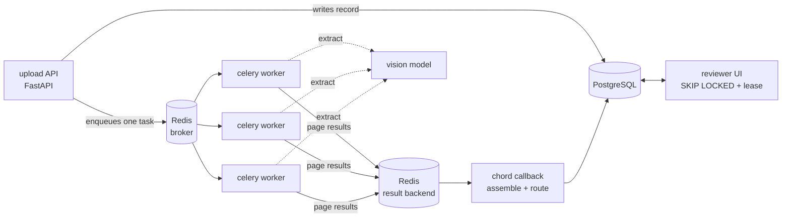
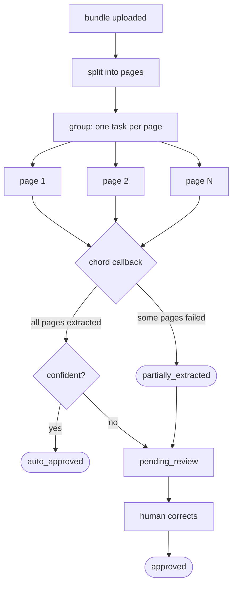
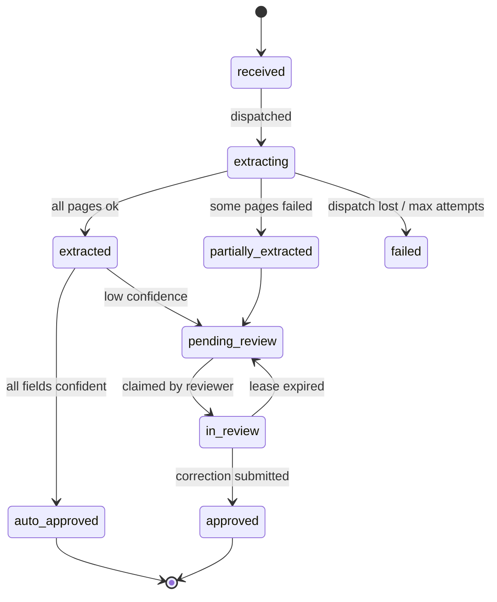
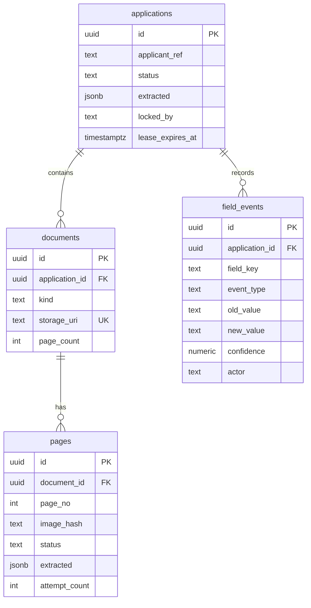

# credit-intake

A credit application arrives as a bundle: application form, three months of
bank statements, payslips, ID. Forty-odd pages. The pages are independent, so
they are extracted in parallel, joined back into one record, and anything the
machine is unsure about still goes to a human.

The extraction is deliberately boring, again. **The fan-out is the project.**

---

## The idea

`01-claim-loop` proved a human review queue does not need a broker. That
argument still holds and this project does not undo it.

What changed is the machine side. One claim was one document was one unit of
work, and Postgres-as-queue handled it perfectly. One credit bundle is forty
independent pages that should be extracted at the same time and then joined.
Expressing *that* in SQL means hand-rolling a fan-out/join protocol: a parent
row, a child table, a completion counter, and a race on the last page to
decide who runs the join.

That is the job a broker actually does well.

So this system runs **two queues on purpose**:

> **Machine work moved to Celery. Human work stayed in Postgres.**

The DECISIONS record explaining why one system uses two different queues for
two different kinds of work is the deliverable. The code is the excuse.

## What it teaches

- Task queues with a real broker: producer, broker, worker, result backend
- Fan-out and join (`group` / `chord`) and what a partial failure does to both
- At-least-once delivery without a database row to lean on (`acks_late`)
- Idempotency, once redelivery is possible
- Retries, exponential backoff, and why jitter is not optional under fan-out
- Rate limiting and backpressure when concurrency is no longer bounded by worker count
- Circuit breaking and graceful degradation when a provider is down
- Content-hash caching, TTLs, and the invalidation problem when the prompt changes
- The two-store consistency problem, met head-on this time

## What it deliberately reuses

Same layered layout, same Postgres, same Qwen3-VL via OpenRouter, same
append-only `field_events` design, same lease-and-reap review queue. Holding
those constant is what makes the comparison against `01-claim-loop` mean
anything.

---

## Architecture

Three stores now, not one: Postgres holds the record, Redis holds the work,
and the result backend holds page results that have not been joined yet. Every
new failure mode in this project comes from that sentence.

## How a bundle flows

The interesting edge is `G`. In `01-claim-loop` there was one row and one
status, so "half of it worked" could not arise. Here it is the common case.

## State machine

## Data model

`pages.image_hash` is what makes the cache possible and what makes retries
idempotent. It carries more weight than its size suggests.

---

## Build plan

| # | Increment | What it is for |
|---|---|---|
| 0 | Write the prediction (D-000) | Guess what Celery gives you and what it costs, **before** building |
| 1 | Synthetic credit bundles + ground truth | Data. Same *kinds* of fields as project 1 so the comparison holds |
| 2 | Schema + migrations | Four tables. Postgres stays the record of truth |
| 3 | Upload API → one Celery task → one page | Prove the wiring end to end, nothing clever |
| 4 | **Kill a worker mid-task** | Message already acked, page never processed. Find `acks_late`. Then meet duplicate work |
| 5 | Fan out with `group` + join with `chord` | The actual point of the project |
| 6 | **Break one page in a group of forty** | Decide what `partially_extracted` means and where it is recorded |
| 7 | Rate limits, backoff, jitter | Forty in-flight calls per bundle. The 429s are not hypothetical |
| 8 | Circuit breaker | Point the provider at a dead host and watch 40 x 3 retries burn |
| 9 | Content-hash cache + TTL | Resubmitted bundle skips 39 pages. Then change the prompt and break it |
| 10 | **Fail the DB write after the task acked** | The two-store problem, live |
| 11 | Review queue + minimal UI | Stays on Postgres. Deliberately |
| 12 | Fill in DECISIONS.md | The deliverable |

Increments 4, 6 and 10 are the project. Everything else exists to make them
possible.

## Depth

**L2**. Containerised, runs locally with Docker Compose. No cloud, no
Kubernetes, no CI/CD. Project 1 covered deployment; repeating it here would
teach nothing new.

## Documents

- [`docs/ARCHITECTURE.md`](docs/ARCHITECTURE.md): how it is built, with components, contracts, sequences and failure analysis
- [`docs/DECISIONS.md`](docs/DECISIONS.md): the record, starting with the prediction
- [`docs/LIMITS.md`](docs/LIMITS.md): what this does not do and where it breaks
