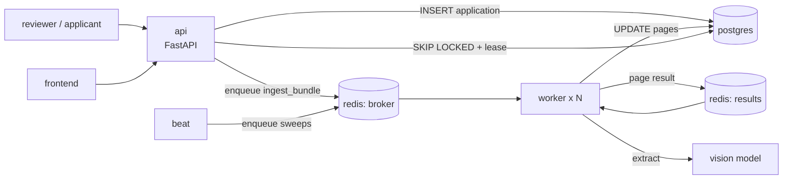
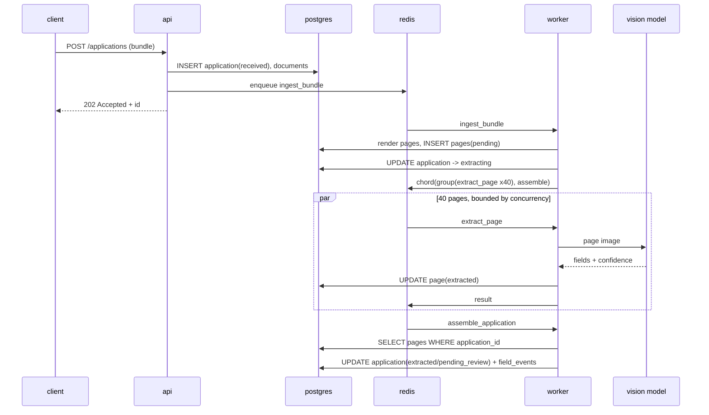

# Architecture

> **Status: DESIGN, not description.** Written before increment 1, so every
> statement here is a claim about a system that does not exist yet. Reality
> will disagree in places. When it does, correct the section **and leave a
> `> Corrected:` note saying what was wrong**. The gap between this document
> and what got built is the most valuable thing the project produces.
>
> This document answers **how**. It does not argue **why**; that lives in
> [DECISIONS.md](DECISIONS.md), and where this design pre-empts an open record
> it is marked so you can still argue against it.

---

## 1. System context

Inside the boundary:

- Accepting a credit bundle and holding the record of it
- Rendering pages, extracting fields with a vision model
- Deciding what a human needs to look at
- Holding the human review queue

Outside the boundary, and assumed:

- **The vision model**: a remote, rate-limited, occasionally-down HTTP API
- **Identity**: no auth, and a reviewer is a string
- **Document storage**: a mounted volume, not object storage
- **Anything downstream**: nothing consumes decisions from this system yet.
  The moment something does, D-006 stops being optional

## 2. Components

Six processes. Each row is a thing that can be restarted independently.

| Process | Owns | Must never |
|---|---|---|
| `api` | HTTP surface, bundle upload, review endpoints | Call the vision model, or do work that outlives a request |
| `worker` | Rendering, extraction, assembly. Horizontally scaled | Hold a DB transaction across a model call |
| `beat` | Periodic dispatch: lease reaping, stuck-application sweep | Do work itself, it only enqueues |
| `redis` | Task transport and page results in flight | Be treated as a source of truth |
| `postgres` | The record: applications, documents, pages, events | Be used as the transport for machine work |
| `frontend` | The reviewer's screen | Hold state the database does not have |

The `api` and the `worker` never talk to each other. They meet through Redis
in one direction and Postgres in the other.

## 3. Runtime shape



## 4. The task graph

Three tasks. The shape of this graph is the architecture.

```
ingest_bundle(application_id)
    └─ chord(
           group( extract_page(page_id) for each page ),
           assemble_application.s(application_id)
       )
```

| Task | Input | Does | Returns |
|---|---|---|---|
| `ingest_bundle` | `application_id` | Renders the PDF to page images, writes `pages` rows, dispatches the chord | chord id |
| `extract_page` | `page_id` | Cache lookup by image hash, else call the model, write `pages.extracted` | small summary dict |
| `assemble_application` | page results, `application_id` | Merges pages into one record, routes it, writes `field_events` | final status |

**`ingest_bundle` is a dispatcher, not a worker.** It should be fast and
cheap, because if it dies halfway you have `pages` rows with no tasks behind
them. Writing all page rows in one transaction *before* dispatching any task
is what makes that recoverable, because the sweep in §7.8 can find them.

## 5. Data ownership

Containers are packaging; ownership is architecture. Nothing outside this
table writes to these.

| Data | Store | Written by | Read by | Durable |
|---|---|---|---|---|
| `applications`, `documents` | Postgres | `api`, `assemble_application` | everything | yes |
| `pages` | Postgres | `ingest_bundle`, `extract_page` | `assemble_application`, reviewer | yes |
| `field_events` | Postgres | `assemble_application`, review endpoint | reviewer, analysis | yes, append-only |
| Queued tasks | Redis | `api`, `beat`, `ingest_bundle` | `worker` | **no** |
| Page results in flight | Redis | `extract_page` | `assemble_application` | **no**, and TTL'd |
| Extraction cache | Redis | `extract_page` | `extract_page` | no, TTL'd |
| Page images | volume | `ingest_bundle` | `extract_page`, reviewer | volume-lifetime |

**Proposed rule:** `extract_page` writes its result to Postgres *and* returns
it. The return value is a convenience for the chord; Postgres is the truth.
This means `assemble_application` can ignore what it was handed and re-read
`pages` from the database.

That one rule dissolves three problems at once: result-backend TTL expiry
stops mattering, a redelivered `extract_page` is idempotent (same hash, same
row, overwritten), and a re-run `assemble_application` produces the same
answer.

> This pre-empts **D-005** and **D-006**. Argue it there before accepting it.
> The cost is a Postgres write on every page, which at 40 pages a bundle is
> not free.

## 6. Happy path



Note the `202` before any work happens. The applicant's request is decoupled
from a ~40-page extraction, and that decoupling is the entire reason the broker
is here.

## 7. Failure analysis

This is the section worth reading. Each case names the increment that forces
you to meet it.

### 7.1 Worker dies mid-`extract_page`, default acking (*increment 4*)
Celery acks on receipt. The message is gone, the page stays `pending`, and
nothing anywhere records that someone was working on it. **This is the failure
`01-claim-loop` structurally could not have**, because there the job *was* the
row. Mitigation: `acks_late=True`.

### 7.2 Worker dies mid-`extract_page`, `acks_late` on (*increment 4*)
The message is redelivered. The page may be extracted twice, and the model is
called twice, which is real money. Mitigation: the cache in §5 turns the second call
into a lookup; the Postgres write is an overwrite of the same row.

### 7.3 One page fails after max retries (*increment 6*)
By default a failing chord member propagates and the callback never runs
normally, stranding 39 good results. Proposed: `extract_page` **never raises**
past its retry budget. It records `pages.status = 'failed'` and returns a
marker. The chord always completes; `assemble_application` decides what a
partial record means. Failure becomes data, not an exception.

### 7.4 Provider returns 429 under fan-out (*increment 7*)
One bundle puts 40 calls in flight. Retrying all 40 after an identical delay
reproduces the burst exactly. Needs a bound (§8) and jitter.

### 7.5 Provider is down (*increment 8*)
40 pages x 3 attempts x every queued bundle, at full speed, all failing. A
breaker must stop calling and requeue with delay rather than exhaust retries.

### 7.6 `assemble_application` succeeds, Postgres write fails (*increment 10*)
Task acked, work gone, application stuck in `extracting`. The two-store
problem. Options in D-006; the sweep in §7.8 is the cheap floor.

### 7.7 Redis restarts and loses queued tasks
Applications sit in `received` or `extracting` forever. Nothing errors. This
is the honest cost of the broker and the sharpest contrast with project 1.

### 7.8 The reconciliation sweep, the safety net under all of the above
A `beat` job every N minutes: any application in `extracting` past a deadline,
or with `pages` still `pending` and no live task, is re-dispatched. It is not
elegant. It is what makes every "message was lost" case recoverable, and it
only works because Postgres holds page state (§5).

### 7.9 Reviewer abandons a review
Unchanged from `01-claim-loop`: `lease_expires_at` plus a reaper. The human
queue keeps its old, working design.

> **Known carried-over bug:** `complete_review` in project 1 updates without a
> lease guard, so an expired reviewer can overwrite another's work. Do not
> copy that shape here.

## 8. Concurrency and bounds

Parallel page extractions in flight:

```
replicas  x  worker_concurrency
```

Postgres connections consumed:

```
(api_replicas x api_pool_max) + (worker_replicas x worker_concurrency x 1)  ≤  max_connections
```

`--scale worker=5` with concurrency 4 is **20 parallel model calls**, and 20
Postgres connections from workers alone. In `01-claim-loop`, three workers
meant three in-flight calls, full stop. Fan-out removed that bound; §7.4 is
about putting it back somewhere deliberate.

Celery's own `rate_limit` is **per worker process**, so it silently loosens
every time you scale. A global bound needs a shared token bucket in Redis;
see D-007.

## 9. Scaling: what breaks at 10x

| At 10x | First thing to break | Why | Fix |
|---|---|---|---|
| bundles/hour | provider rate limit | global, and unaffected by more workers | queue depth is the buffer; accept latency |
| workers | Postgres connections | the arithmetic in §8 | pgbouncer, or lower per-worker pool |
| pages/bundle | chord memory | result backend holds every page result until join | §5 rule makes results small |
| review volume | nothing | 0.08/sec is four orders of magnitude of headroom | none needed, this is D-011's whole point |

The bottleneck is the provider, and it is the one place where adding machines
does not help. Everything else is arithmetic.

## 10. The two-queue split

Stated precisely, because it is the thesis:

| | Machine work | Human work |
|---|---|---|
| Queue | Redis, via Celery | Postgres `status` column + partial index |
| Unit | one page | one application |
| Rate | seconds, thousands/hour possible | minutes, ~0.08/sec |
| Claiming | broker delivery | `FOR UPDATE SKIP LOCKED` |
| Recovery | `acks_late` + redelivery + sweep | lease expiry + reaper |
| Atomic with its data? | **no**, separate stores | **yes**, same row |

The last row is the whole argument. Human work needs "submit the correction
and leave the queue" to be one transaction. Machine work does not, and in
exchange gets fan-out.

## 11. Deployment

L2. One Compose file: `api`, `worker` (scalable), `beat`, `redis`, `postgres`,
`frontend`. Parameters in `config.yml`, secrets in the environment. No cloud,
because project 1 covered that.

## 12. Open questions this design does not settle

- Global rate limiting across scaled workers: **D-007**
- Which errors are retryable, and the backoff curve: **D-008**
- Breaker thresholds and whether to degrade to a fallback model: **D-009**
- Cache key composition and prompt-change invalidation: **D-010**
- Whether the §5 rule is worth a Postgres write per page: **D-005, D-006**
