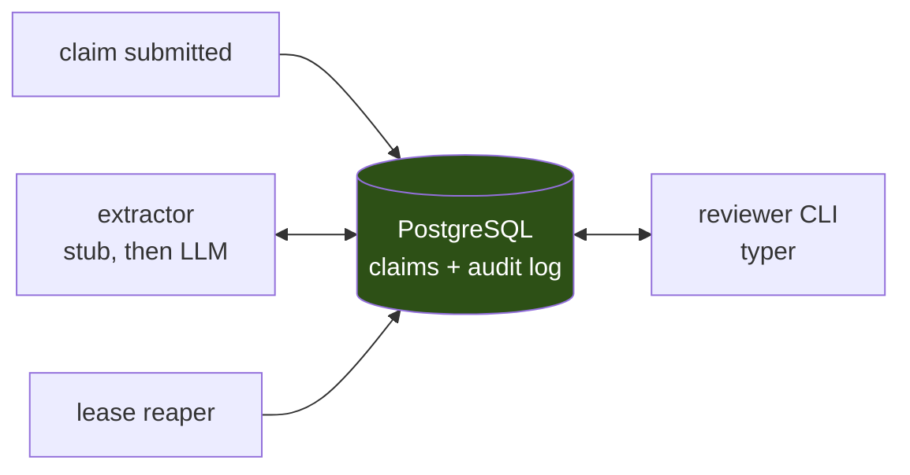

# claim-loop

A human-in-the-loop claims processing system: documents come in, a machine
extracts fields, low-confidence extractions are routed to a human reviewer, and
the human's correction is captured as a first-class signal — not as an
overwrite.

The extraction is deliberately boring. **The queue is the project.**

## What this teaches

Putting a human in a pipeline turns a request/response call into an async
queue with a state machine, where the worker is slow, expensive, unreliable,
and cannot be cheaply retried. Everything hard about this system follows from
that one fact.

- Async queues and producer/consumer, built on Postgres
- Task claiming without double-assignment (`FOR UPDATE SKIP LOCKED`)
- Leases, abandoned work, and at-least-once delivery with a human consumer
- Schema design for an append-only correction log
- Confidence routing and the cost model behind the threshold
- LLM observability, and closing the loop by attaching human verdicts to traces

## Stack

Postgres is the queue. There is no broker, and that is the design — the queue
entry and the claim are the same row, so completing a review is one transaction
in one store. See DECISIONS.md D-001.

**v0.1**

| Layer | Choice |
|---|---|
| Runtime | Python 3.12+, `uv` for dependencies |
| Database | PostgreSQL 16, in Docker locally |
| Driver | `psycopg[binary,pool]` — psycopg 3, raw SQL, no ORM |
| Migrations | numbered `.sql` in `migrations/`, applied by a runner in `src/` |
| Queue | the `claims` table — `FOR UPDATE SKIP LOCKED` + a lease column |
| Reviewer CLI | `typer` + `rich` |
| Tests | `pytest` + `testcontainers[postgres]` |

**Added by later increments**

| Increment | Adds |
|---|---|
| 5 — real extraction | `anthropic` |
| 6 — tracing | `langfuse` (Cloud free tier) |
| 7 — metrics | `structlog`, JSON to stdout |
| 8 — L2 | Dockerfile (multi-stage, `python:3.12-slim`) + docker compose |
| 9 — HTTP | `fastapi` + `uvicorn[standard]`, if a UI is wanted |
| 10 — deploy | Cloud Run + Cloud SQL + Secret Manager |

**Deliberately excluded**

No Redis, no Celery/RQ, no ORM, no Alembic, no Kafka, no Kubernetes, no CI.
Each of those is excluded for a reason written down in DECISIONS.md, not by
oversight. Redis is deferred to a separate project where it is load-bearing —
a rate limiter — because a tool used where it isn't needed teaches the wrong
reflex.

## Status

<!-- TODO: keep this honest as increments land -->
Not started. Scaffolding only.

## Architecture

All diagrams here are Mermaid in fenced code blocks — GitHub renders them
natively, and because they are text they diff properly in review instead of
being an opaque binary that goes stale.

### Components

The one thing to notice: **there is no broker.** The database is the queue.



A claim's queue entry and its data are the same row, so a reviewer completing
work is one transaction against one store. Nothing to keep in sync, nothing to
half-fail. The full argument is DECISIONS.md D-001.

### Claim lifecycle

<!-- TODO: fill in from DECISIONS.md D-002 once the states are settled.
     Mermaid state diagram syntax, for reference:

     ```mermaid
     stateDiagram-v2
         [*] --> uploaded
         uploaded --> extracting: worker picks it up
         extracting --> pending_review: confidence below threshold
         extracting --> approved: auto-approved
         pending_review --> in_review: reviewer claims it
         in_review --> pending_review: lease expired
         in_review --> approved
         approved --> [*]
     ```

     Replace the above with MY states and MY transitions. Every arrow needs a
     trigger label — an unlabelled arrow means I have not decided what causes it. -->

### Schema

<!-- TODO: fill in once D-002 and D-004 are settled.
     Mermaid ER diagram syntax, for reference:

     ```mermaid
     erDiagram
         CLAIMS ||--o{ EXTRACTED_FIELDS : has
         CLAIMS {
             uuid id PK
             text status
             timestamptz lease_expires_at
         }
     ```

     Must show: the state column, the lease columns, the append-only correction
     log, and every index — especially the partial index the claiming query
     needs. -->

### Where the transaction boundaries are

<!-- TODO: the most important section in this file.
     For each operation — claim, complete, reap — state exactly what is inside
     one transaction and why. This is where the correctness lives. -->

## Running it

<!-- TODO -->

## Repo layout

```
claim-loop/
├── README.md       what it does, how to run it, the architecture
├── DECISIONS.md    what I considered, what I chose, why, what I'd change
├── LIMITS.md       what breaks at scale, and what I'd do about it
├── migrations/     numbered .sql, applied in order
└── src/
```
